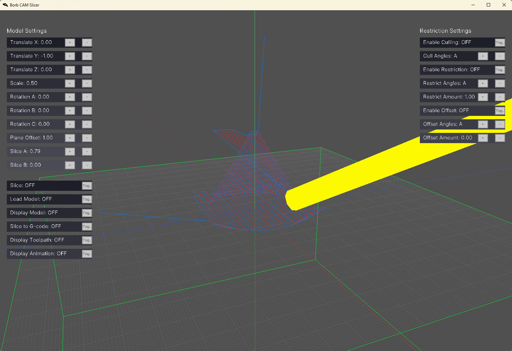

# Borb CAM Slicer
Borb CAM Slicer is a CNC toolpath generator built for makers, engineers, and artists who need real multi-axis control. It converts 3D OBJ models into clean, efficient G-code for machines ranging from simple 3-axis mills to full 6-axis CNC setups. Instead of just stacking flat slices, Borb CAM interprets triangular mesh geometry to create surface-following toolpaths that hug curves, slopes, and deep cuts — perfect for complex and organic shapes. It supports dynamic tool and machine setups, adaptive step control, and advanced multi-axis motion planning. Whether you're carving sculptures, machining parts, or building molds, Borb CAM gives you the flexibility to go from raw 3D geometry to a finished piece with fewer compromises, fewer crashes, and a lot more control.

## Features
* <strong>Equation Based Tool Path: </strong> Planar Equation Support
* <strong>Model Support: </strong> OBJ
* <strong>Output Support: </strong> Gcode
* <strong>Tool Pathing: </strong> 2.5D, 3D, 3-6 Dof

## Roadmap
* Milestones: Exports Gcode
* Milestones: Dynamic Model Loading / Unloading
* Milestones: Triangulation Algorithm
* Milestones: Multi Mesh Detection
* Milestones: Mesh Disconnected Island Detection
* Milestones: 2D Tool Path Generation
* Milestones: Normal Surface Calculation
* Milestones: Normal to GCode Angle Compensation
* Milestoness: 2D to 2.5D Tool Path Joiner
* Work In Progress: Tool Path Offset SDF Function
* Work In Progress: Multi Pass Tool Path Generation
* Work In Progress: Configuration Settings Menu
* Planned: Better GUI
* Planned: Better Frontend